# SOC Home Lab - Microsoft Sentinel

## Overview

This project demonstrates a cloud-based SOC Home Lab built using Microsoft Sentinel in Microsoft Azure. The lab was designed to simulate real-world attack detections, log monitoring, incident analysis, and SIEM operations using custom analytics rules and KQL queries.

The project includes 9 detection use cases mapped to the MITRE ATT&CK Framework.

---

## Lab Architecture

```
Windows VM (Attack Simulation)
        |
        | Windows Security Events + Sysmon Logs
        ▼
Azure Monitor Agent (AMA)
        |
        | Log forwarding via Data Collection Rule (DCR)
        ▼
Log Analytics Workspace
        |
        | Queried by KQL Analytics Rules
        ▼
Microsoft Sentinel
        |
        ├── Analytics Rules (9 custom detection rules)
        ├── Incidents & Alerts Dashboard
        └── Threat Investigation & Triage
```

**Resources used:**
- Resource Group: SOCLab-RG
- Windows Server VM — attack simulation target
- Azure Monitor Agent (AMA) — log collection
- Data Collection Rule (DCR) — routes logs to workspace
- Log Analytics Workspace — stores all security events
- Microsoft Sentinel — SIEM for detection and investigation

---

## Technologies Used

- Microsoft Sentinel
- Azure Log Analytics
- Azure Monitor Agent (AMA)
- Kusto Query Language (KQL)
- Windows Security Events
- Sysmon
- MITRE ATT&CK Framework

---

## Detection Use Cases

### 1. Brute Force Detection
- Detects multiple failed login attempts within a 5-minute window
- MITRE Technique: T1110
- KQL Rule: [brute-force.kql](./KQL-Rules/brute-force.kql)

### Rule Overview
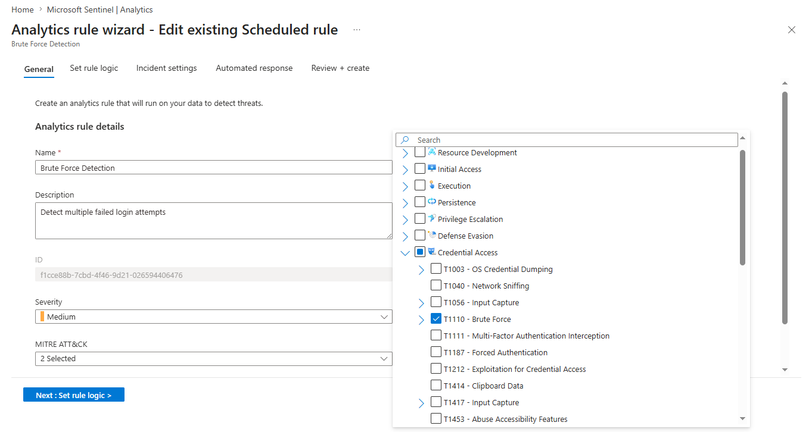

### Detection Query
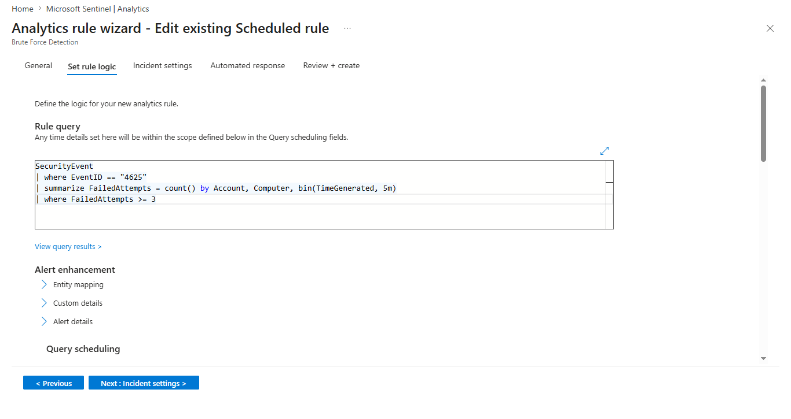

---

### 2. Credential Dumping Detection
- Detects suspicious LSASS access activity using known tools like procdump
- MITRE Technique: T1003
- KQL Rule: [credential-dumping.kql](./KQL-Rules/credential-dumping.kql)

### Rule Overview
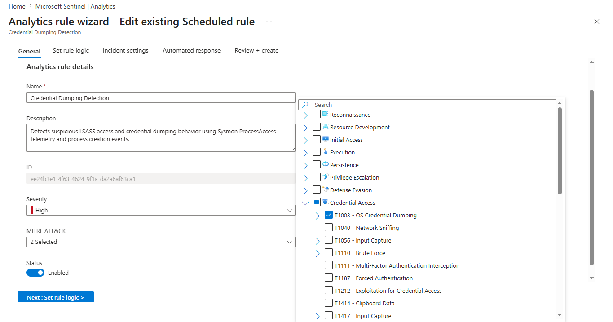

### Detection Query
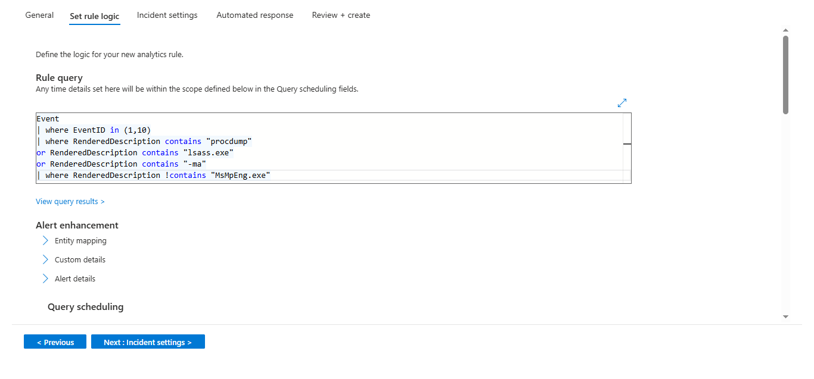

---

### 3. Encoded PowerShell Detection
- Detects Base64 encoded PowerShell commands used to evade detection
- MITRE Technique: T1059.001
- KQL Rule: [encoded-powershell.kql](./KQL-Rules/encoded-powershell.kql)

### Rule Overview
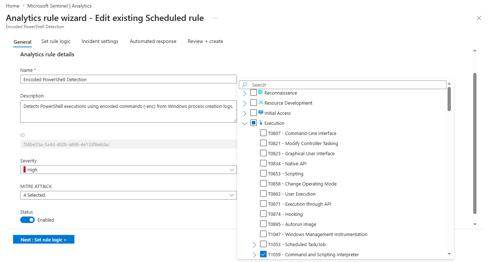

### Detection Query
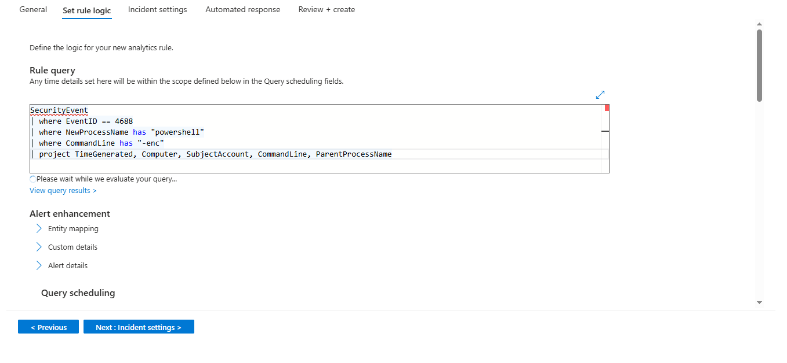

---

### 4. Registry Persistence Detection
- Detects suspicious modifications to CurrentVersion\Run registry key
- MITRE Technique: T1547
- KQL Rule: [registry-persistence.kql](./KQL-Rules/registry-persistence.kql)

### Rule Overview
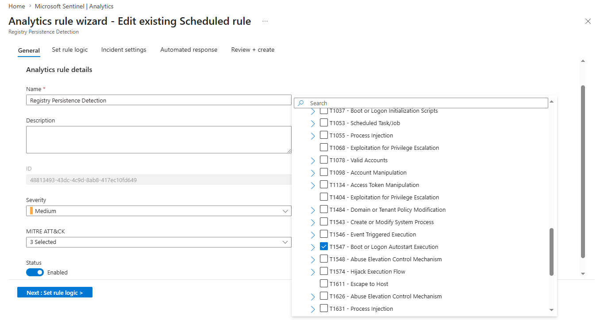

### Detection Query
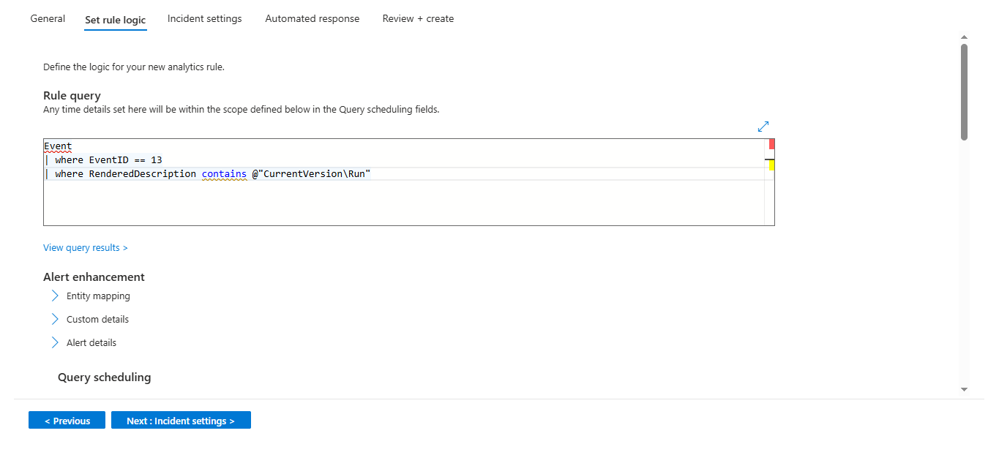

---

### 5. Scheduled Task Persistence Detection
- Detects malicious scheduled task creation (Event ID 4698)
- MITRE Technique: T1053
- KQL Rule: [scheduled-task-persistence.kql](./KQL-Rules/scheduled-task-persistence.kql)

### Rule Overview
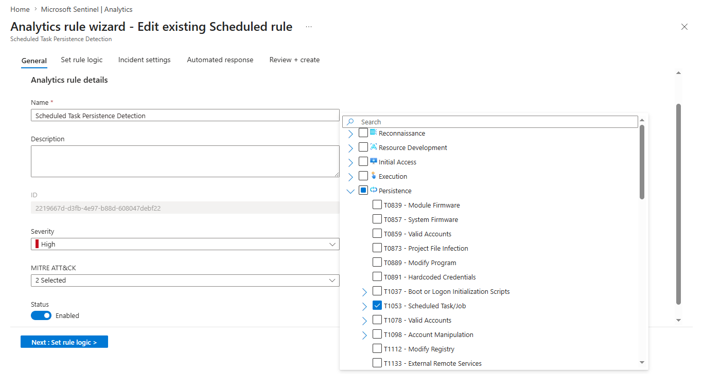

### Detection Query
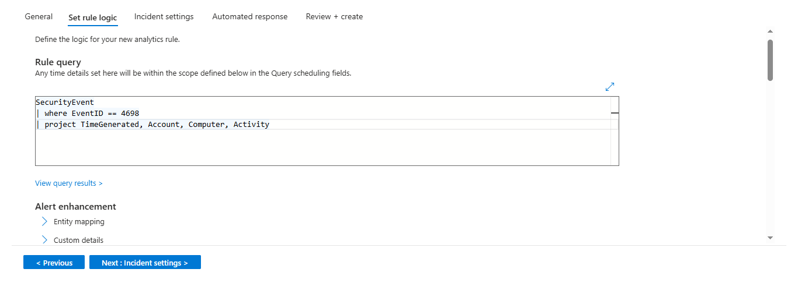

---

### 6. Suspicious Local Admin Account Creation
- Detects unauthorized local administrator account creation
- MITRE Technique: T1136
- KQL Rule: [suspicious-local-admin-creation.kql](./KQL-Rules/suspicious-local-admin-creation.kql)

### Rule Overview
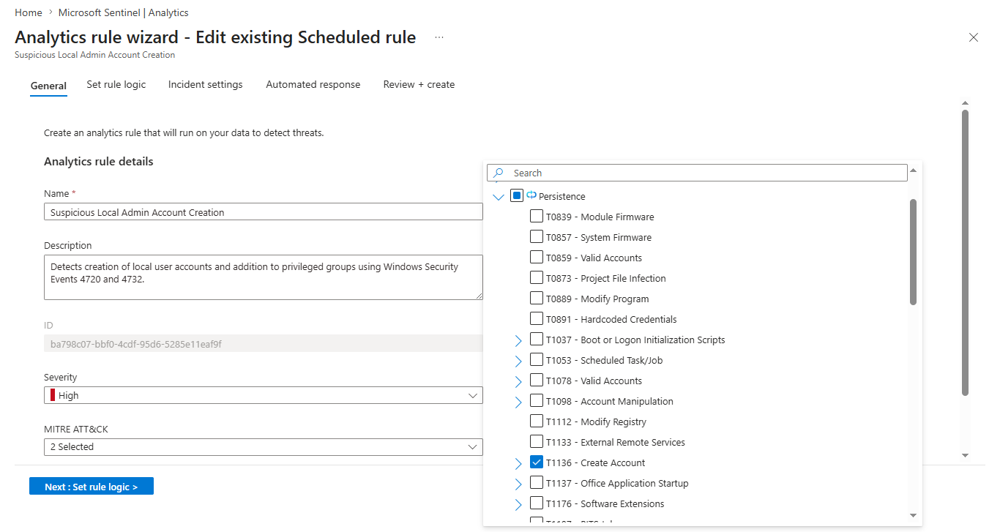

### Detection Query
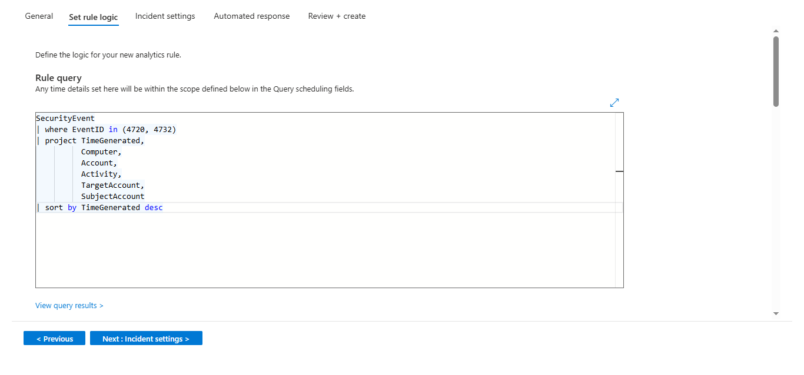

---

### 7. LOLBins Execution Detection
- Detects abuse of certutil, bitsadmin, rundll32, mshta for malicious purposes
- MITRE Technique: T1218
- KQL Rule: [lolbins-execution.kql](./KQL-Rules/lolbins-execution.kql)

### Rule Overview
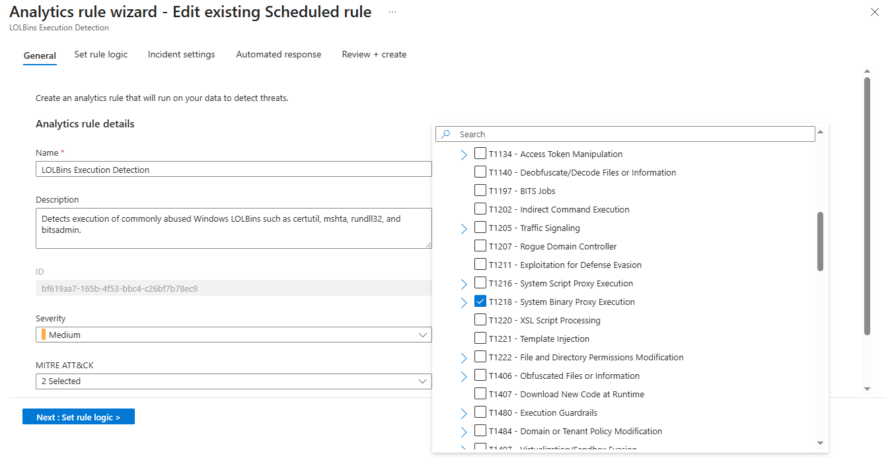

### Detection Query
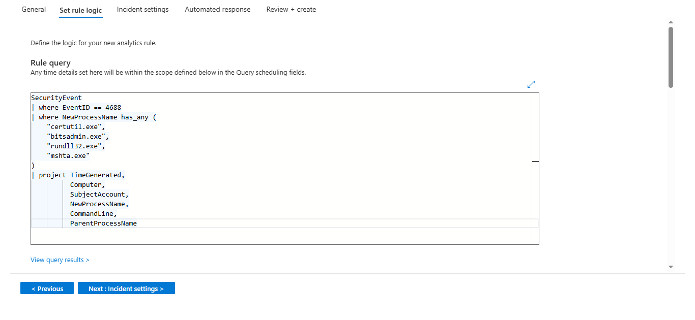

---

### 8. Suspicious Parent Process Spawning PowerShell
- Detects PowerShell launched by unusual parents like cmd.exe, wscript.exe
- MITRE Technique: T1059.001
- KQL Rule: [suspicious-parent-process-powershell.kql](./KQL-Rules/suspicious-parent-process-powershell.kql)

### Rule Overview
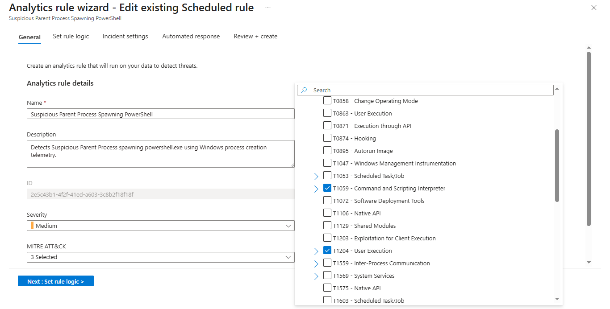

### Detection Query
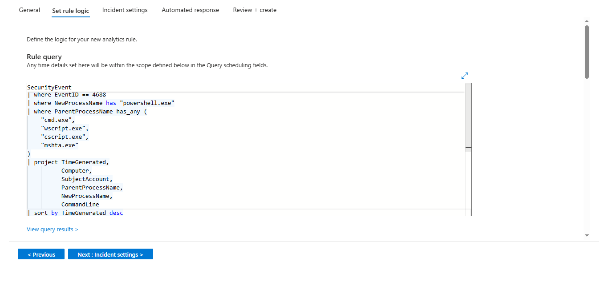

---

### 9. Ransomware Shadow Copy Deletion Detection
- Detects vssadmin delete shadows — a hallmark behaviour of ransomware
- MITRE Technique: T1490
- KQL Rule: [ransomware-shadow-deletion.kql](./KQL-Rules/ransomware-shadow-deletion.kql)

### Rule Overview
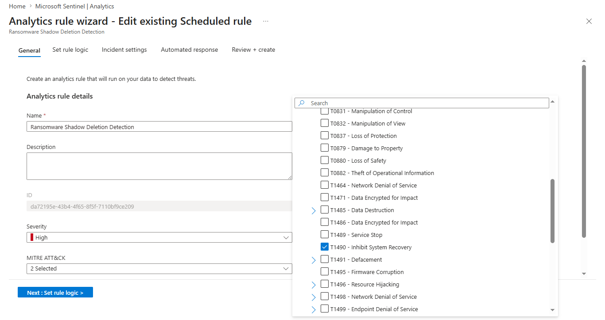

### Detection Query
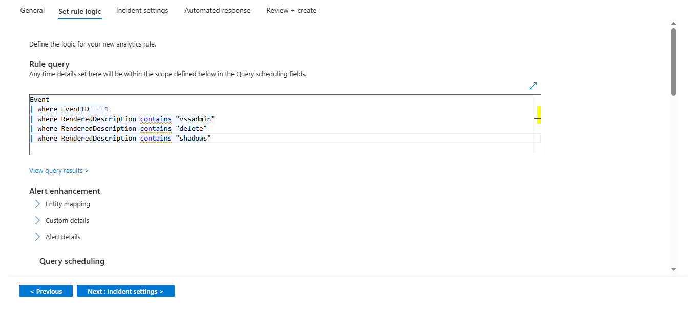

---

## Additional Screenshots

### Active Analytics Rules
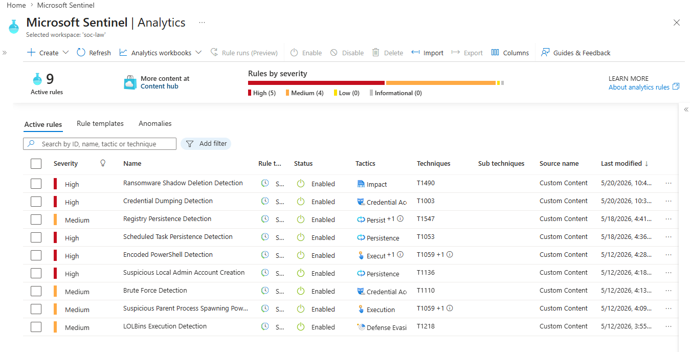

### Alerts and Incidents
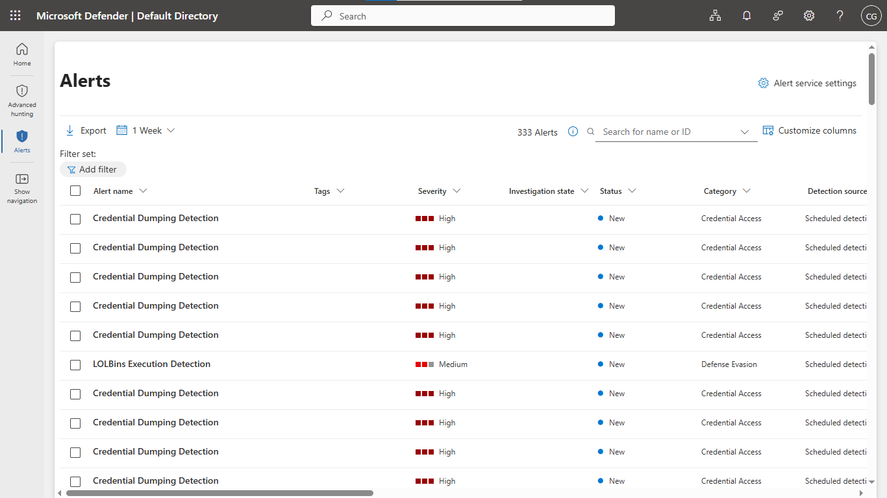

---

## Incident Investigation Walkthrough

### Scenario: Brute Force Alert Triggered

**Step 1 — Alert fired**
Microsoft Sentinel raised an incident after detecting 3+ failed login attempts (Event ID 4625) from the same account within a 5-minute window.

**Step 2 — Investigated in Sentinel**
Opened the incident in Sentinel. Reviewed the alert details — identified the affected account name, source computer, and timestamp of the failed attempts.

**Step 3 — Ran KQL to dig deeper**
```kql
SecurityEvent
| where EventID == "4625"
| summarize FailedAttempts = count() by Account, Computer, bin(TimeGenerated, 5m)
| where FailedAttempts >= 3
| sort by TimeGenerated desc
```
Confirmed repeated failures from a single account in a short window — consistent with a brute force attempt.

**Step 4 — Triage decision**
Incident classified as a **True Positive**. In a real SOC, next steps would be to isolate the machine, reset credentials, and escalate to Tier 2 if lateral movement was detected.

**Step 5 — Incident closed**
Incident marked as resolved with notes documenting the finding.

---

## Key Skills Demonstrated

- SIEM Monitoring & Configuration
- Threat Detection and Analysis
- KQL Query Development
- Incident Investigation & Triage
- Log Analysis
- MITRE ATT&CK Mapping
- SOC Operations
- Security Event Correlation
- Alert Triage
- Azure Cloud Security

---

## What I Learned

- How to architect a cloud SIEM from scratch using Azure native tools
- Writing KQL detection logic for real-world attack techniques
- The difference between noisy rules and high-fidelity detections
- How to triage alerts and classify True Positive vs False Positive
- Mapping detections to MITRE ATT&CK to communicate threat context clearly

---

## Author

Chandan G

LinkedIn: https://linkedin.com/in/chandan-g-7749573a6

GitHub: https://github.com/Chandan-G-04
